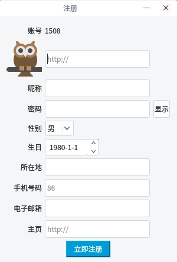
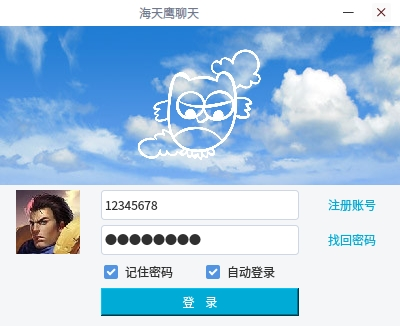
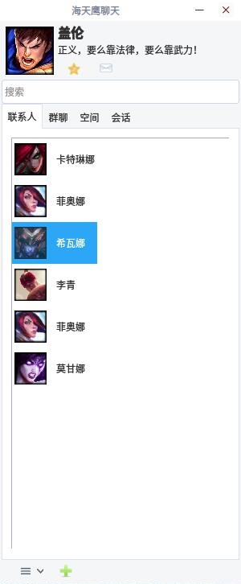
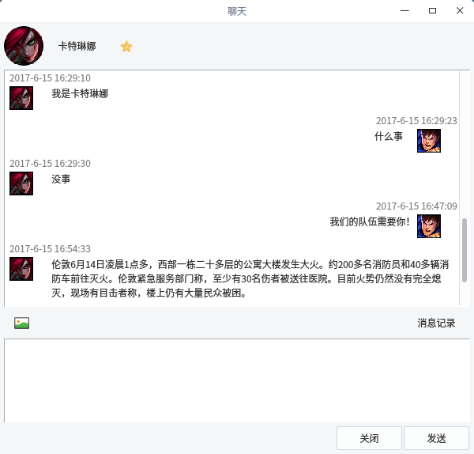

# Qt 海天鹰聊天 1.0 Alpha

###注册
  
密码未加密，请勿使用常用密码！
### 登录
  
### 联系人
  
### 聊天
  

Linux 平台基于 Qt + MYSQL 的聊天程序。  
已编译好的 HTYChat 程序适用 64 位 Linux 系统 Qt5 环境，双击运行，其他版本请自行编译。  

### 依赖：
Qt5 安装 MYSQL 插件：sudo apt-get install libqt5sql5-mysql

### 已知问题：
因为从数据库读消息，需要通过发消息或者点击消息记录更新，人多的话数据库可能会读写死，未来可能采用点对点模式替代。  
只能发文字，不能发图片。  
修改资料后无法立即更新主面板资料，下次登录才能更新资料。